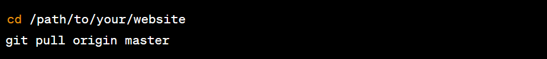

# Flask Blog

## Contents

- [User Experience (UX)](#user-experience-ux)
- [Design](#design)
    - [Colour Scheme](#colour-scheme)
    - [Typography](#typography)
    - [Imagery](#imagery)
    - [Wireframes](#wireframes)
    - [Features](#features)
- [Technologies Used](#technologies-used)
- [Deployment & Local Development](#deployment--local-development)
    - [Deployment](#deployment)
    - [Local Development](#local-development)
    - [How to Fork](#how-to-fork)
    - [How to Clone](#how-to-clone)
- [Testing](#testing)
    - [W3C Validator](#w3c-validator)
    - [Solved Bugs](#solved-bugs)
    - [Known Bugs](#known-bugs)
- [Validation and Formatting](#validation-and-formatting)
- [Testing User Stories](#testing-user-stories)
- [Future Developments](#future-developments)
- [Content](#content)

---

## User Experience (UX)

Flask Blog is a website aimed at providing users with engaging and insightful blog content. The site strives to create
an informative and user-friendly experience for visitors interested in exploring various topics through blog posts.

### Key Information

- Name: Flask Blog
- Website: [https://blog.devross.co.uk](https://blog.devross.co.uk/)
- Purpose: To offer a diverse range of blog content for readers.
- Target Audience: Individuals interested in exploring and reading blog posts on various subjects.

### User Goals

The main goals of users visiting Flask Blog are:

- To discover interesting and well-written blog posts on different topics.
- To easily navigate through the website and find content that matches their interests.
- To engage with the content through comments and feedback.
- To share their favorite blog posts with others.

### First Time Visitor Goals

- Understand the purpose of the website.
- Navigate through different blog categories to discover diverse content.
- Find out how to get involved or leave comments on blog posts.

### Returning Visitor Goals

- Check for new blog posts, updates, or featured content.
- Revisit specific categories for more blog posts on preferred topics.
- Interact with the blog community through comments and discussions.

### Frequent Visitor Goals

- Contribute to the blog community by submitting guest posts or ideas.
- Share blog posts on social media platforms.
- Participate in polls or surveys related to blog content preferences.

## Design

### Wireframes

[Link to wireframes on GitHub](https://github.com/itzrossyo/blog-flask/tree/main/lib/readmeimages/wireframes)

### Colour Scheme

The website will use a modern and minimalistic color scheme, primarily consisting of pastel colors, promoting a clean
and inviting visual experience.

### Typography

The font used on the website will be a clean and easily readable sans-serif typeface, ensuring an enjoyable reading
experience for users.

### Imagery

High-quality and relevant images will be strategically used throughout the website to enhance visual appeal and maintain
user engagement.

### Features

- Informative Blog Posts
- User Registration and Login
- Commenting System

#### Header

The header will be fixed at the top of the page, featuring a navigation menu.

#### Footer

The footer will contain essential elements, including links to social media, copyright information, and potentially a
newsletter subscription form.

## Technologies Used

- HTML5
- CSS3
- JavaScript
- Python
- Flask
- SQLAlchemy
- Bcrypt
- Jinja2

## Deployment & Local Development

### Deployment

The website is currently deployed at [https://blog.devross.co.uk/](https://blog.devross.co.uk/).

### Local Development

To run the website locally, follow these steps:

1. Clone the repository from [https://github.com/itzrossyo/blog-flask.git](https://github.com/itzrossyo/blog-flask.git).
2. Open the index.html file in your preferred web browser.

### How to Fork

To fork the Flask Blog repository:

1. Log in (or sign up) to GitHub.
2. Go to the repository for this project, [blog-flask](https://github.com/itzrossyo/blog-flask).
3. Click the Fork button in the top right corner.

### How to Clone

To clone the Flask Blog repository:

1. Log in (or sign up) to GitHub.
2. Go to the repository for this project, [blog-flask](https://github.com/itzrossyo/blog-flask).
3. Click on the code button, select whether you would like to clone with
   HTTPS https://github.com/itzrossyo/blog-flask.git and copy the link shown.
4. Open the terminal in your code editor and change the current working directory to the location you want to use for
   the cloned directory.
5. Type 'git clone' into the terminal and then paste the link you copied in step 3. Press enter.

## Testing

- Laptop
    - MacBook Pro 13 2019
    - HP Omen 15 inch
    - Dell XPS
- Mobile
    - Oppo Find X5 Lite (6.42inch)
    - Samsung S22 Ultra
    - iPhone 13 Pro Max
    - iPhone 12 Max
    - iPhone 12
    - Google Pixel 6
- Browsers
    - Google Chrome
    - Firefox
    - Opera
    - Safari

| Feature                 | Expected Outcome                                                                                                           | Testing Performed                                                                                                              | Result                                              | Pass/Fail |
|-------------------------|----------------------------------------------------------------------------------------------------------------------------|--------------------------------------------------------------------------------------------------------------------------------|-----------------------------------------------------|-----------|
| Font-Awesome Icons      | Icons will be used on the menu dropdown to indicate what links do what for a friendly user experience.                     | Clicked the hamburger button on mobile and desktop to confirm icons display and animate.                                       | Icons displayed and animated as expected.           | Pass      |
| 404 Error Page          | This should come up when the user page won't load or is down, giving them a custom special message.                        | Accessed a non-existing URL to trigger the 404 page. Verified the custom message.                                              | Custom 404 page appeared with the correct message.  | Pass      |
| Informative Blog Posts  | Users can explore diverse blog posts on different topics.                                                                  | Browsed through various blog categories and read different blog posts.                                                         | Blog posts displayed and covered a range of topics. | Pass      |
| User Registration/Login | A user registration and login system allow users to create accounts, log in, and securely access personalized features.    | Attempted to register new user accounts and log in with existing accounts. Verified account creation and secure login process. | User accounts created, and login process secure.    | Pass      |
| Dropdown Menu           | Once the hamburger button has been pressed on mobile, a dropdown menu will slide in from the left with a smooth animation. | This test was performed by clicking on the hamburger menu to see if the dropdown menu will show up smoothly.                   | This worked as intended.                            | Pass      |

---

### W3C Validator

[Link to GitHub W3C Validation images](https://github.com/itzrossyo/blog-flask/tree/main/lib/readmeimages/htmlcssvalidtation)

### Solved Bugs

| Num | Bug                                        | How I Solved the Bug                                                                                                                                             |
|-----|--------------------------------------------|------------------------------------------------------------------------------------------------------------------------------------------------------------------|
| 1   | Incorrect Data Displayed on Blog Post Page | Confirmed the source of the data being displayed. If the data is fetched from a database, reviewed the database queries and verified the data retrieval process. |
| 2   | Unresponsive Design on Mobile Devices      | Implemented a responsive design using media queries in CSS. Ensured that the layout, images, and content adjusted appropriately to different screen sizes.       |
| 3   | Commenting System Not Displaying Comments  | Reviewed the Python and JavaScript code responsible for handling the commenting system. Ensured that the backend processed and stored comments correctly.        |
| 4   | Unintended Page Redirects                  | Examined the HTML code for the links causing the issue. Ensured that the href attributes of the links pointed to the correct file paths or URLs.                 |

### Known Bugs

| Known Bugs | Bug Issue | Plan to Resolve |
|------------|-----------|-----------------|
| None       |           |                 |

## Validation and Formatting

[Images for validation with JSHint](https://github.com/itzrossyo/blog-flask/tree/main/lib/readmeimages/jshintcleanup)

The website's code will be validated and properly formatted to adhere to industry best practices.

## Testing User Stories

| Testing User Stories |                          | User Story                                                                                                                        | Test Case                                                                              | Result                                                                                                                               |
|----------------------|--------------------------|-----------------------------------------------------------------------------------------------------------------------------------|----------------------------------------------------------------------------------------|--------------------------------------------------------------------------------------------------------------------------------------|
| User Story           | Newcomer Exploration     | As a newcomer to the blog, I want to understand the types of content available and find interesting blog posts on various topics. | Navigate to the homepage and read the introductory content about the blog.             | The homepage provides a clear and concise introduction to the blog, catering to newcomers' need for basic understanding.             |

## Future Developments

I would love to expand on this by incorporating additional features such as:

- A search functionality for users to find specific topics easily.
- Integration with social media platforms for seamless sharing of blog posts.

### Content

The blog content will continue to cover a wide range of topics, ensuring diversity and relevance to various reader
interests.

## Prerequisites

1. Git Installed: Make sure Git is installed on your local machine.

2. SSH Key Pair: Ensure you have an SSH key pair set up for secure communication with your server.

3. Web Server Installed: Have a web server (Nginx) installed and configured on your Linux server

4. other user other than root as this is recommended

### 1. Clone the Git Repository:

On your local machine, open a terminal and navigate to the directory where you want to store your website files.

### 2. Step-by-Step Deployment:

Configure the Web Server:
Configure your web server to serve the files from the cloned repository. This involves creating a virtual host or
configuring the default site. The configuration details depend on your web server.
Config a config.json file

`sudo touch /etc/config.json`    

`sudo nano /etc/config.json`

* In your json add the following 

`{
  "SECRET_kEY": "your_Secret_key",`  
  `"SQLALCHEMY_DATABASE_URI": "sqlite:///site.db"` 
  `"EMAIL_USER": "your email",` 
  `"EMAIL_PASS": "Your_Email_Password"
}`

* Now open the Config.py in the flaskblog folder
`sudo nano flask/blog/config.py` and enter the following  
   
`import os`
 `import json`   
`with open('/etc/config.json') as config_file:
    config = json.load(config_file)`  
 
`class Config:
    SQLALCHEMY_DATABASE_URI = config.get('SQLALCHEMY_DATABASE_URI')
    SECRET_KEY = config.get('SECRET_KEY')
    MAIL_SERVER = 'smtp.googlemail.com'
    MAIL_PORT = 587
    MAIL_USE_TLS = True
    MAIL_USERNAME = config.get('EMAIL_USER')
    MAIL_PASSWORD = config.get('EMAIL_PASS')`
 

* Edit the Nginx configuration file, usually located at /etc/nginx/sites-available/default, and set the root to the
  directory where your website files are.
  

### 3. Push Changes to the Server:

Commit your changes locally and push them to the server.

### 4. Pull Changes on the Server:

On the server, navigate to the website directory and pull the changes.

Then cd into the folder and run pip install -r requirements.txt

### 5. Restart the Web Server:

After pulling the changes, restart your web server to apply the new configurations.
